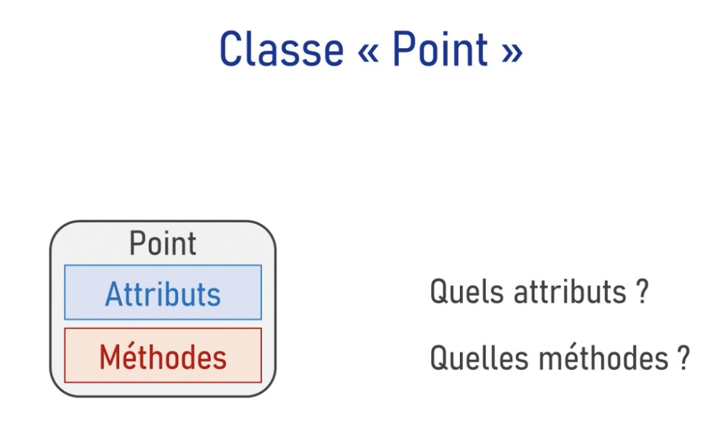
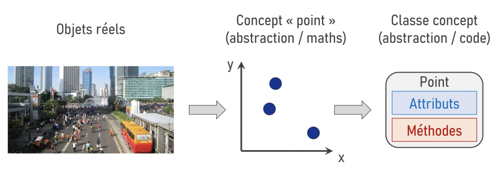
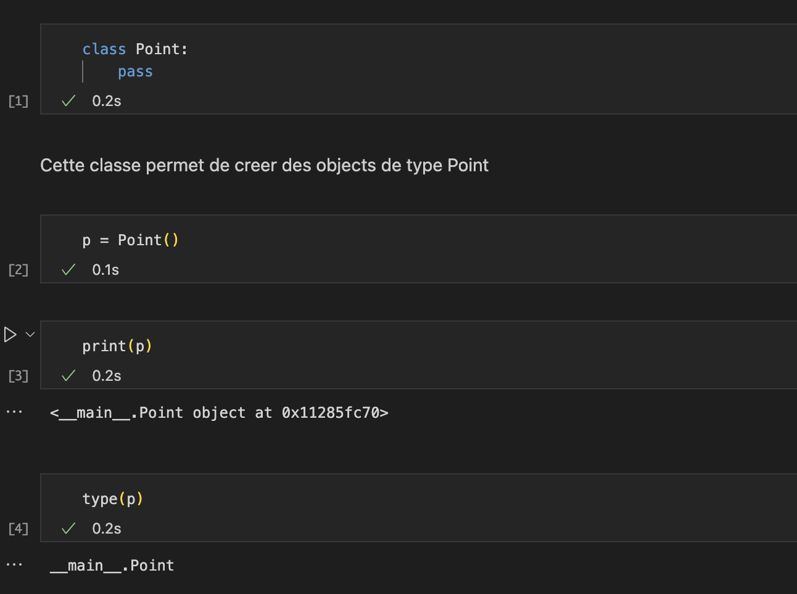
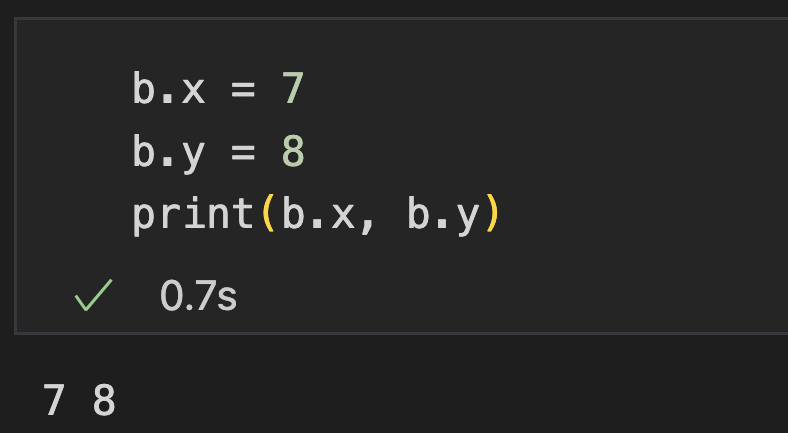
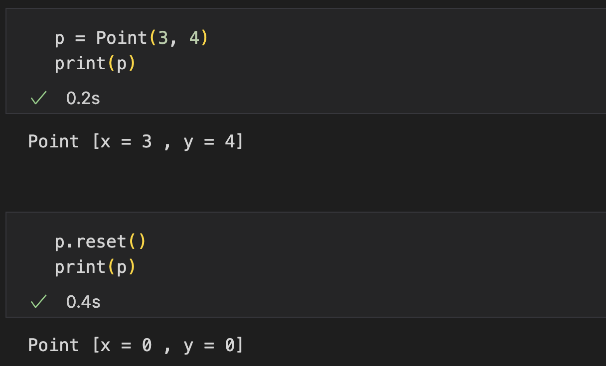
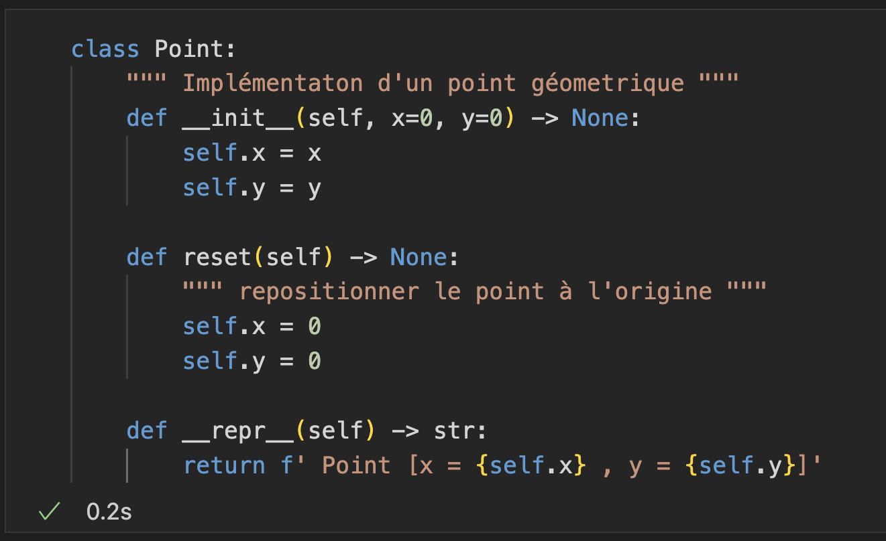

```{r setup, include=FALSE}
knitr::opts_chunk$set(echo = FALSE)

# Learn more about creating blogs with Distill at:
# https://rstudio.github.io/distill/blog.html

```


## Attributs et Méthodes

Nous savons qu'une classe se décrit par ses attributs et ses méthodes. Pour notre classe Point, quels sont ses attributs et ses méthodes?

<center>
{width=60%}
</center>


Et bien pour les identifier, il nous faut passer par la phase de conception qui est présente dans tous les projets de développement. Explicitons les étapes de la conception qui nous mène au code. 

En général la conception d’une classe se fait souvent à partir des objets réels, des idées ou des concepts métiers. En analysant les objets réels on crée un concept, une abstraction qui modélise la réalité. Un point est une abstraction mathématique qui modélise la position des objets. À partir de ce concept mathématique, le concept métier, le développeur crée une autre abstraction cette fois informatique qui représente le concept métier en tant qu’une classe s’il travaille dans le paradigme orienté objet. On parle parfois de classe concepts. Toutes ces représentations sont conceptuelles, elles ne sont liées pour le moment à aucun langage.


<center>
{width=80%}
</center>


C’est à l'étape de l’implémentation que le développeur traduit la conception d'une classe dans un code concret avec un langage choisi. Avec le point géométrique nous avons de la chance parce que la première étape a déjà été faite pour nous, notamment par Euclide. Nous pouvons nous baser simplement sur sa conception. Le point, selon Euclide, est ce qui n’a aucune partie. Un point désigne un `emplacement`. Sa seule caractéristique est sa `position`.
Dans l’espace euclidien à deux dimensions, la position est décrite par deux coordonnées `x` et `y` qui sont ici les **attributs** de la classe Point. Les **méthodes**définissent les actions possibles avec les points. Nous avons par exemple les méthodes `reset()` qui ramène tout point à l’origine, la méthode `shift(dx, dy)` qui réalise les déplacements élémentaires, `dx` et `dy` seront les **arguments** de cette méthode. On peut également ajouter la possibilité de calculer la distance entre deux points avec la méthode `calculate_distance(...)`.

<center>
{width=60%}
</center>

Nous pouvons donc considerer que la conception est terminee. Passons maintenant a l'implémentation.
`


## Implémentation

Une classe en python se crée avec le mot-clé `class` suivi du nom de la classe. Par convention le nom de la classe commence par une majuscule et lorsqu’il est composé de plusieurs mots on utilise le style *CapWords*. Dans ce style les mots sont attachés et commencent par une majuscule comme MyClass, BankAccount, etc...


<center>

{width=40%}
</center>


La classe la plus simple c'est la classe vide qui n'a pas de contenu, pour cela on utilise le mot-clé `pass`. Notre première classe est créée pour l'instant elle est vide elle ne sait rien faire.

l’objet `p` est une instance de la classe `Point`. Le type de la variable `p` est Point par contre il est précédé par le mot-clé `__main__` réservé dans python qui designe *module principal*. Nous avons défini la classe Point dans le programme principal. La classe est alors attachée au module `__main__`. On pourrait en théorie avoir un autre `module` avec une autre classe nommée Point définie dans ce module dans ce cas cette autre classe serait précédée par le nom du module et non par `__main__` ainsi il n'a pas de conflit de noms on pourrait éventuellement utiliser les deux classes **Point** dans le code.


Si on imprime la variable `p` à l’écran, on obtient la représentation par défaut d’un objet en Pyhton. Il s’agit d’un objet de la classe Point défini dans le module `__main__` suivi de l’adresse de l’objet présentée en mémoire en  hexadécimal.


## Definir les attributs de la classe Point sur python


Commençons à remplir progressivement le contenu  de la classe. Comment définir les attributs ? 
Pour construire la classe Point, on utilise  la méthode avec un nom prédéfini en Python qui  
s'appelle `__init__` avec deux underscores avant  et après. Cette méthode est le constructeur de  
la classe **Point**, elle sera exécutée quand on  instancie un objet de cette classe. C'est dans  
cette méthode qu'on définit les attributs. Dans la signature du constructeur,  
le premier argument doit obligatoirement être la  référence à l'instance de la classe elle-même,  
par convention appelée `self`. Dans  certains langages, comme PHP, C++ ou Java,  
on utilise le mot-clé `this`. En Python, Ruby,  Objective-C, c'est self. En Visual Basic, on  
utilise le mot-clé Me. `Self` signifie littéralement  
soi-même. C'est la référence, à l'intérieur de la  classe, à l'instance qu'on peut créer avec cette  
classe. Autrement dit, quand on crée un `objet`  de la classe **Point**, `self` référence cet objet. 
On donne ensuite d'autre arguments qui nous  sont nécessaires pour construire un objet.  
Pour un point, ce sont ses coordonnées : `x` et  `y`. La ligne `self.x = x` signifie que pour tout  
objet de la classe Point (référencé ici par  le mot-clé `self`) on crée un attribut `x` et la  
valeur de cet attribut sera égale à celle donnée  en argument d'entrée de la méthode `__init__`. 
La même chose pour l'attribut `y`. Les arguments `x` et `y` sont maintenant obligatoires  
pour instancier un objet de la classe **Point**  parce que nous les avons explicitement définis  
dans la signature du constructeur `__init__`.


<center>
{width=40%}
</center>

Maintenant on peut instancier le point a,  
en précisant directement ses coordonnées dans  le constructeur. Quand on écrit cette ligne,  
Python exécute le constructeur __init__  qu'on vient de créer. Un développeur  
lirait cette ligne de la façon suivante : a  est un point avec les attributs x=1 et y=2. 

<center>
{width=35%}
</center>

Les attributs de l'objet sont accessibles  avec l'opérateur ".". On peut afficher le  
contenu des attributs du point `a` : `a.x` et `a.y`. 

<center>
{width=35%}
</center>

Une classe permet d'instancier plusieurs objets  
du même type. Il est tout à fait possible de  créer un deuxième point `b` avec les coordonnées  
`x=5` et `y=9`. Avec `b.x` et `b.y` on accède aux  valeurs des attributs `x` et `y` du point `b`. 

<center>
{width=30%}
</center>

Il est possible de modifier directement  les attributs de l'objet, en écrivant,  
par exemple, b.x=7 et b.y=8. On change  ainsi les coordonnées du point b. 

<center>
{width=30%}
</center>


Cette façon d'écrire peut choquer profondément les  développeurs qui ont l'habitude de travailler dans  
d'autres langages, comme C++, Java ou PHP. Il  se trouve que dans le paradigme orienté objet,  
il existe le principe d'encapsulation  qui suggère de protéger l'état interne  
de l'objet des accès extérieurs directs.


Au moins, ces accès doivent être contrôlés. 
Dans beaucoup de langages orientés objets,  la politique est restrictive : par défaut, on  
interdit tous les accès et on autorise seulement  certain accès quand c'est nécessaire. Python a la  
politique inverse. Tous les accès sont publics.  Si le développeur pense que certains attributs  
doivent être protégés, il existe des conventions  qui lui permettent de l'indiquer dans le code. 


## Remarque

Dans la plupart des langages orientés objets classiques, comme `C++` ou `Java`, l'accès direct aux attributs `(par exemple, b.x
= 7)` est fortement déconseillé, voire interdit, pour respecter le principe `encapsulation`. Dans ces langages, il est habituellement nécessaire de définir des méthodes spécifiques (**getters** et **setters**) pour manipuler les attributs. En Python, les attributs des objets sont
par défaut publiques et peuvent être accédés directement. Il existe toutefois des conventions en Python qui permettent d'indiquer
explicitement qu'un *attribut est interne à l'objet* et qu'il ne doit pas être accédé directement même si techniquement cela reste possible.


Vous vous souvenez que dans le constructeur de la classe nous avons imposé deux arguments  d'entrée : x et y. Cela veut dire que nous  
ne pouvons plus instancier un point sans donner  d'argument. Notamment, le code `p = Point()` sans arguments produit une erreur parce que les  arguments `x` et `y` sont justement manquants. 

<center>
{width=50%}
</center>

Ce n'est pas toujours très pratique. Il serait  bien de pouvoir créer un point sans arguments  
en considérant qu'il sera initialisé par défaut  à l'origine du repère : `x=0` et `y=0`. Pour cela,  
il est possible de définir des valeurs par  défaut pour les attributs. On peut le faire  
dans la signature du constructeur en précisant  les valeurs par défaut pour chaque argument.  


<center>
{width=50%}
</center>


Si `x` et `y` ne sont pas précisés, le constructeur  utilisera ces valeurs pour instancier l'objet. 


<center>
{width=35%}
</center>

Nous savons maintenant travailler avec  les **attributs**. Il est temps d'attaquer les **méthodes**. Commençons par une méthode prédéfinie  dans Python qui permet de représenter un objet. 


## Definir une representation de l'objet


Commençons par une méthode prédéfinie  dans Python qui permet de représenter un objet. Nous avons déjà remarqué que quand on souhaite  afficher le contenu de l'objet à l'écran avec la commande print, on obtient: `p` est  un objet Point du module `__main__` qui se trouve à telle adresse en mémoire. Or, dans la plupart  des cas, quand on affiche un objet, on cherche à savoir l'état courant de l'objet, c'est-à-dire  les valeurs courantes de ses attributs, plutôt que son adresse en mémoire. Dans notre  cas, ce sont les coordonnées `x` et `y` du point `p`.

Une autre information importante pour l'affichage  est le type de l'objet. Si on travaille avec un grand nombre d'objets différents dans le  programme, il est utile de rappeler à l'affichage le nom de la classe à laquelle appartient l'objet. Idéalement, on voudrait introduire une représentation de l'objet comme une chaine  de caractères formattée qui contient le  
nom de la classe et les valeurs des attributs

<center>
{width=60%}
</center>

En Python, il existe la méthode spéciale `__repr__`, avec les doubles underscores, qui permet  de redéfinir la représentation officielle de l'objet. *Il suffit d'intégrer cette méthode  à l'intérieur de la classe et de préciser dans le corps de la méthode comment on souhaite  représenter les objets de cette classe*. La commande print affiche  la représentation qu'on souhaite ci dessous.

<center>
{width=50%}
</center>


En Python, il existe en réalité plusieurs  méthodes réservées à la représentation de l'objet, dont `__repr__`, `__str__` et `__format__`. Ces  méthodes sont légèrement différentes et les développeurs sont parfois confus pour savoir laquelle de ces méthodes il faut utiliser dans leurs classes. Si vous souhaitez définir  une seule représentation qui fonctionne dans  
tous les cas, choisissez la méthode `__repr__`. Les méthodes que nous avons étudiées jusqu'à maintenant sont des méthodes prédéfinies dans  Python, comme le constructeur `__init__` ou la représentation `__repr__`. On reconnait  leur caractère interne réservé à Python par les doubles underscores dans le nom. Mais comment on peut créer nos propres méthodes qui n'existe pas dans Python ? Cela se fait de la façon similaire. 


A l'intérieur de la classe, on crée une méthode en  lui donnant le nom qu'on souhaite, cette fois-ci sans les underscores. Par exemple, on peut définir  la méthode `reset` qui remet le point à l'origine du repère, en modifiant ses coordonnées en `x=0, y=0`. Visuellement, on peut distinguer facilement les méthodes prédéfinies dans Python qui portent les  underscores et les nouvelles méthodes définies par le développeur qui ont des noms habituels,  sans les underscores.

<center>
{width=55%}
</center>

Exceptionnellement, le développeur peut dans certains cas créer de  nouvelles méthodes spéciales avec les underscores. Il s'agit des cas très particuliers. Dans la  majorité des cas, nous n'en avons pas besoin.

Pour utiliser notre nouvelle méthode `reset()`,  créons d'abord un point p avec les coordonnées `x=3, y=4`. L'appelle de la méthode `reset()`  se fait avec l'opérateur `« . »`, comme pour les attributs : `p.reset()`. A la différence  des attributs, les méthodes sont appelées avec les parenthèses qui peuvent éventuellement  contenir des arguments quand c'est nécessaire. 
L'appel de la méthode `reset()` remet le point `p` à  l'origine du repère. On voit à l'affichage que ses  
coordonnées sont devenues `x=0` et `y=0`.


<center>
{width=55%}
</center>


Dans le vocabulaire orienté objet, on dit que le programme principal `__main__` a  envoyé un message `reset()` à l'objet `p`. Cette  
façon de parler est parfois un peu perturbante  pour les développeurs. On se perd facilement dans qui envoie quel message à qui. Vous pouvez retenir qu'une méthode est vue comme la réception d'un message dans la  programmation orientée objet. Pour un objet, exécuter une méthode est la même chose  que recevoir un message.


<center>
{width=55%}
</center>

Dans notre cas, l'objet` p` reçoit un message qui s'appelle  `reset()` de la part du programme principal. Suite  
à ce message, il enclenche les actions qui sont  décrites dans la méthode `reset()`, c'est-à-dire,  
poser les attributs de l'objet `x=0` et `y=0`. 

Pour résumer, `p.reset()` se lit comme : *l'objet `p` reçoit un message `reset()`*. L'objet `p` est  le récepteur du message. L'expéditeur du message c'est l'objet dans lequel la ligne de  code `p.reset()` est exécutée. Dans notre cas,  
c'est le programme principal, le module `__main__`.  Notre classe Point est presque complète maintenant. Nous avons des attributs et certaines  méthodes. Nous pouvons peaufiner encore un tout petit peu sa présentation pour  qu'on puisse la partager avec d'autres développeurs. Ils pourront ainsi intégrer notre  classe Point dans leur code et le réutiliser. 

Quand on veut partager notre code, il est souvent  nécessaire de créer la documentation. En Python, comme dans beaucoup d'autres langages, la  documentation peut être intégrée dans le code  et ensuite générée et exportée automatiquement  dans différents formats. C'est une **bonne pratique**  de créer la documentation à l'intérieur du code  avec la notation **docstring**. On peut documenter une  
`classe, une méthode, un module ou une fonction`.  La documentation commence à la ligne suivante, tout de suite après le nom de la classe. Le texte  est précédé et terminé par `trois guillemets`. 


La documentation docstring est reconnue  automatiquement par Python. Elle est enregistrée dans un attribut spécial nommé `__doc__`  avec les doubles underscores. Ces attributs sont exploités par des outils qui génèrent  automatiquement la documentation, tels que **pydoc**. Il est également courant d'annoter les  types de variables utilisées dans les  
classes. Ces annotations sont ignorées à  l'exécution par Python mais elles peuvent être exploitées notamment par l'outil **mypy** qui  permet de travailler avec le *typage statique*.  


<center>
{width=55%}
</center>


Beaucoup de développeurs utilisent  ces annotations pour tester leurs codes. 
Dans le constructeur on peut préciser que  les variables `x` et `y` sont de type **float**. La  
méthode `__init__` ne renvoie aucune valeur,  son type de retour est **None**. En revanche,  
la méthode `__repr__` renvoie un argument,  il s'agit d'une **chaine de caractère** que représente l'objet. Son type de retour est **str**.  On l'indique à chaque fois avec une `flèche`. 

<center>
{width=45%}
</center>


Pour s'entrainer à utiliser toutes ces nouvelles  notions, faisons un petit exercice assez simple

## Exercice

<center>
{width=55%}
</center>


## Conception

<center>
{width=75%}
</center>

<center>
{width=25%}
</center>

## Implementation

<center>
{width=50%}
</center>

<center>
{width=65%}
</center>


C'était tout pour ce tutoriel

**Merci pour la lecture**

---


